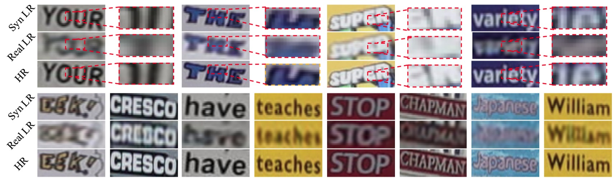
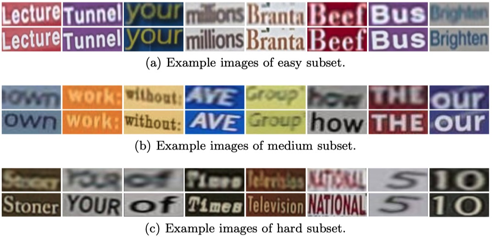
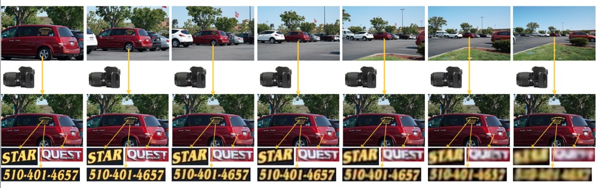
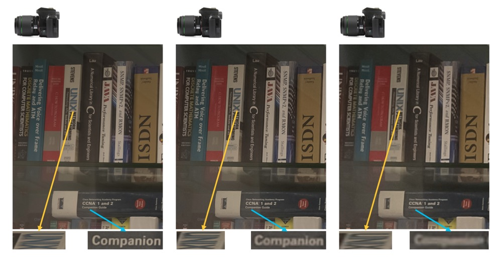

# A super-resolution dataset consists of paired LR-HR scene text images.

## Requirements
- 1.0.1 <= torch < 1.6.0
- torchvision -c pytorch
- lmdb >= 0.98
- pillow >= 7.1.2
- numpy
- six
- tqdm
- python-opencv
- easydict
- yaml

## Train and Test

download the Aster model from https://github.com/ayumiymk/aster.pytorch, Moran model from https://github.com/Canjie-Luo/MORAN_v2, 
CRNN model from https://github.com/meijieru/crnn.pytorch.

Change `TRAIN.VAL.rec_pretrained` in **src/configs/super_resolution.yaml** to your Aster model path, change `TRAIN.VAL.moran_pretrained` to your MORAN model path and 
change `TRAIN.VAL.crnn_pretrained` to your CRNN  model path.

Change `TRAIN.train_data_dir` to your train data path.
Change `TRAIN.VAL.val_data_dir` to your val data path.

- train with textzoom

`cd ./src/`

`python3 main.py --batch_size=1024 --STN --mask --gradient --vis_dir='vis'`

- test with textzoom

`python3 main.py --batch_size=1024 --test --test_data_dir='your-test-lmdb-dataset' --resume='your-model.pth' --STN --mask --gradient --vis_dir='vis'`

- demo with images

`python3 main.py --demo --demo_dir='./images/'  --resume='your-model.pth' --STN --mask`

## TextZoom Dataset (allocated by size): 

Paper: [arxiv](https://arxiv.org/abs/2005.03341)

Data (Lmdb): [Badiu NetDisk](https://pan.baidu.com/s/1PYdNqo0GIeamkYHXJmRlDw). password: **kybq**; 
[Google Drive](https://drive.google.com/drive/folders/1WRVy-fC_KrembPkaI68uqQ9wyaptibMh?usp=sharing)
```
lmxb keys: 

def buf2PIL(txn, key, type='RGB'):
    imgbuf = txn.get(key)
    buf = six.BytesIO()
    buf.write(imgbuf)
    buf.seek(0)
    im = Image.open(buf).convert(type)
    return im
    
nSamples = int(txn.get(b'num-samples'))

label_key = b'label-%09d' % index
word = str(txn.get(label_key).decode())

img_HR_key = b'image_hr-%09d' % index 
img_lr_key = b'image_lr-%09d' % index
img_HR = buf2PIL(txn, img_HR_key, 'RGB')
img_lr = buf2PIL(txn, img_lr_key, 'RGB')
```

The LR images in TextZoom is much more challenging than synthetic LR images(BICUBIC).



We allocate our dataset into 3 part following difficulty: easy, medium and hard subset. The misalignment and ambiguity increases as the difficulty increases.



For each pair of LR-HR images, we provide the annotation of the case sensitive character string (including punctuation), the type of the bounding box, and the original focal lengths.

## Other data

- Cropped text images from SR_RAW (.png, allocated by original images): [BaiduNet Disk](https://pan.baidu.com/s/1deWqGQTbiITrayFNrrJg-w).  password: **ykbq**; 
[Google Drive](https://drive.google.com/file/d/1-5T89MPLtDhQWdtiqXFbBqE5bTKA5VEA/view?usp=sharing)

- Cropped text images from RealSR (.png, allocated by original images): [BaiduNet Disk](https://pan.baidu.com/s/1gjwQ05THh-MJv3oChvm3FA).  password: **f615**; 
[Google Drive](https://drive.google.com/file/d/1xDqEA9OHYvyoycPqaMER-QZM8LI20fVN/view?usp=sharing)

- Annotation of SR_RAW (.json, bounding boxs and word labels): [Baidu NetDisk](https://pan.baidu.com/s/1OQpiItFTiYHhZyhbg1ASWg). password: **kmme**; 
[Google Drive](https://drive.google.com/file/d/1zvxtjZ8-IGHgFKwDoE8fs3G6RlZrA3v5/view?usp=sharing)


- Annotation of RealSR (.json bounding boxs and word labels): [Baidu NetDisk](https://pan.baidu.com/s/19-_jnlxJhWrUs_2n9JUsiw). password: **i52c**; 
[Google Drive](https://drive.google.com/file/d/1HX1hTStsIKt23HLN2F2Q74h8bbdu205a/view?usp=sharing)


```
    architecture of json: (sr_raw.json and real_sr.json have the same arch)
    'position' is the bounding box,
    'rawFileName' is the original image name, you need to download the SRRAW and RealSR dataset.
    'words' is the word label.
    'type' means the direction of bounding box, 'td' means top down, 'vn' means negative vertical (counterclockwise 90 degrees), 
    'vp' means positive vertical (clockwise 90 degrees), 'h' means horizontal.

    
    with open('real_sr.json') as f:
        d=json.load(f)
    d['0']=
    {'channal': '3',
     'height':  '2300',
     'id':      'cbe0e4cba6ba6cd42d8ed4779087214a',
     'polygons': {'wordRect': 
                 [{'line-type': 'straight',
                    'position': [{'x': '247.94625', 'y': '186.31634'},
                     {'x': '99.29263', 'y': '186.60167'},
                     {'x': '99.29263', 'y': '165.77304'},
                     {'x': '247.94625', 'y': '166.34369'}],
                    'type': 'td',
                    'valid': 'true',
                    **'words': 'QU04029757'**},
                   {'line-type': 'straight',
                    'position': [{'x': '63.18353', 'y': '703.61181'},
                     {'x': '61.66713', 'y': '542.87290'},
                     {'x': '127.88347', 'y': '540.85103'},
                     {'x': '130.41081', 'y': '702.60087'}],
                    'type': 'vn',
                    'valid': 'true',
                    'words': '100'},
                   ...
                   ]},
     'rawFilePath':   'test',
     'rawFilename':   'Canon_046_HR.png',
     'result_version': '1.0',
     'rotate':    '0',
     'valid':     'true',
     'width':     '2500',
     'wordRect-validity': 'true'}
```
